# API de Usuarios y Preferencias Musicales 
Alumna: Ángela López Oliva
## Descripción del proyecto 

Este proyecto implementa una **API REST desarrolllada con Django y Django REST Framework** para la gestión de usuarios y sus preferencias musicales.

Cada usuario puede definir: 
- su **artista favorito** 
- su **canción favorita**

Además, la aplicación se integra con la **API externa de Spotify**, permitiendo obtener información real sobre artistas y canciones a partir de su nombre, utilizando credenciales de tipo *Client Credentials*.

El proyecto se ha desarrollado siguiendo los contenidos vistos en clase, poniendo especial atención en la organización del código, la validación de datos y el manejo de errores.

## Tecnologías utilizadas 
- Python 3 
- Django
- Django REST Framework
- SQLite
- Requests
- Postman

## Inicialización del proyecto

El proyecto se inicializó creando un entorno virtual para aislar las dependencias y utilizando Django para generar la estructura base de la aplicación.

#### Creación del entorno virtual

- python -m venv venv
- venv\Scripts\activate      

#### Instalación de dependencias
- pip install django
- pip install djangorestframework
- pip install requests

Las dependencias utilizadas se recogen posteriormente en el archivo requirements.txt.

#### Creación del proyecto y aplicaciones
- django-admin startproject api_server
- python manage.py startapp users
- python manage.py startapp music

#### Migraciones 
- python manage.py makemigrations
- python manage.py migrate

## Arquitectura y organización del proyecto

El proyecto se ha estructurado siguiendo la arquitectura estándar de Django, separando responsabilidades en distintas aplicaciones.

### Proyecto principal
- **api_server**: contiene la configuración global del proyecto (settings, urls, etc.).

### Aplicaciones
- **users**: encargada de la gestión de usuarios.
- **music**: encargada de la gestión de preferencias musicales y de la integración con Spotify.

Esta separación permite mantener un código más limpio, modular y fácil de mantener.

---

## Modelado de datos

### Usuario
Se ha definido un modelo `User` con los siguientes campos:
- `username` (único)
- `email` (único)
- `age` (opcional)

Este modelo representa a los usuarios de la API y es la base sobre la que se relacionan las preferencias musicales.

### Preferencias musicales
Para las preferencias se han definido dos modelos independientes:
- `FavoriteArtist`
- `FavoriteTrack`

Ambos modelos mantienen una relación **OneToOne** con el usuario, garantizando que cada usuario tenga **un único artista favorito y una única canción favorita**.

Este enfoque simplifica la lógica y evita inconsistencias en los datos.

---

# Implementación de la API REST

## Gestión de usuarios
La gestión de usuarios se ha implementado mediante un **ViewSet**, lo que permite disponer de un CRUD completo con menos código y de forma estructurada.

Las operaciones disponibles son:

### POST /api-users/users/ - Crear usuario

Este endpoint permite crear un nuevo usuario en el sistema.
Se valida que el nombre de usuario y el email sean únicos.

**Validaciones:**
- Campos obligatorios
- Email válido
- Usuario y email no duplicados

**Respuesta:**
- 201 Created si el usuario se crea correctamente
- 400 Bad Request si los datos no son válidos

**Captura Postman:**

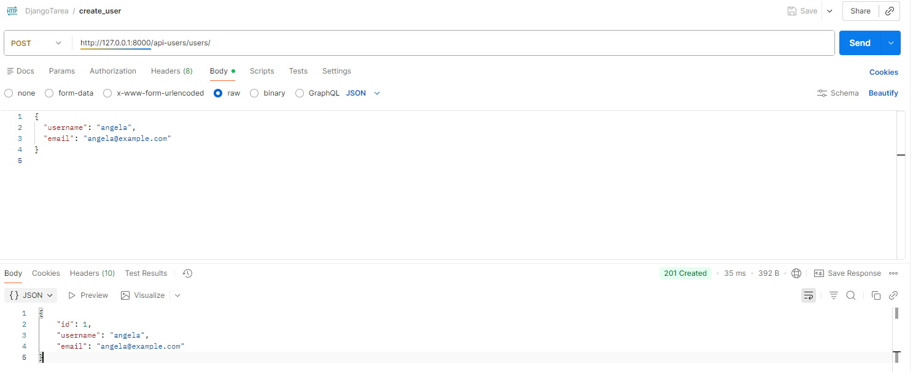

---

### GET /api-users/users/ - Listar usuarios

Este endpoint devuelve el listado completo de usuarios almacenados en la base de datos.

**Respuesta:**
- 200 OK con la lista de usuarios

**Captura Postman:**

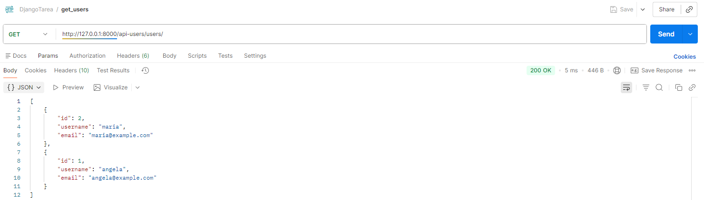

### GET /api-users/users/{id}/ -  Obtener usuario por ID

Permite obtener la información de un usuario concreto mediante su identificador.

**Validaciones:**
- El usuario debe existir

**Respuesta:**
- 200 OK si existe
- 404 Not Found si no existe

**Captura Postman:**
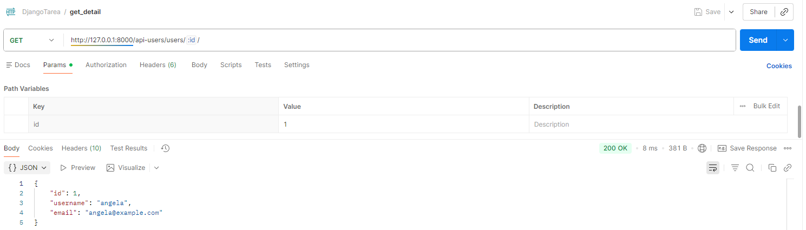

### PUT /api-users/users/{id}/ - Actualizar usuario

Permite modificar los datos de un usuario existente.

**Validaciones:**
- El usuario debe existir
- Datos válidos

**Respuesta:**
- 200 OK si se actualiza correctamente
- 400 Bad Request si los datos no son válidos
- 404 Not Found si no existe

**Captura Postman:**
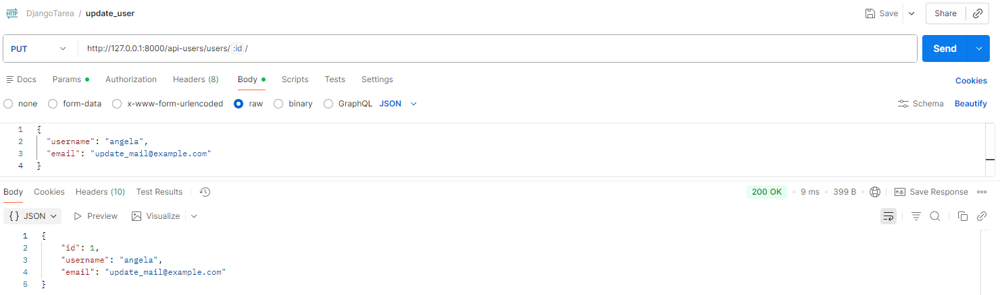

### DELETE /api-users/users/{id}/ - Eliminar usuario

Elimina un usuario de la base de datos.

**Validaciones:**
- El usuario debe existir

**Respuesta:**
- 204 No Content si se elimina
- 404 Not Found si no existe

**Captura Postman:**
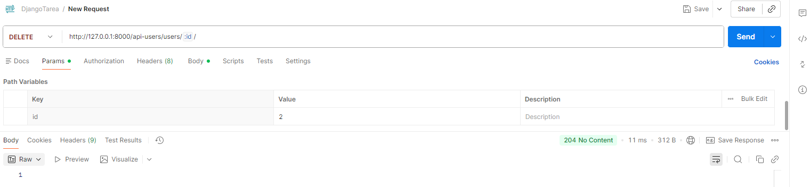

## Gestión de preferencias musicales

### POST /api-music/users/{id}/artist/ - Añadir artista favorito

Permite asignar un artista favorito a un usuario.
Cada usuario solo puede tener un artista favorito.

**Validaciones:**
- El usuario debe existir
- No debe existir ya un artista favorito

**Respuesta:**
- 201 Created
- 404 Not Found
- 409 Conflict si ya existe

**Captura Postman:**

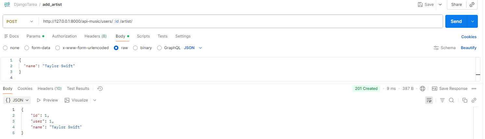

### GET /api-music/users/{id}/artist/ - Obtener artista favorito

Devuelve el artista favorito asociado a un usuario.

**Respuesta:**
- 200 OK
- 404 Not Found si no existe

**Captura Postman:**
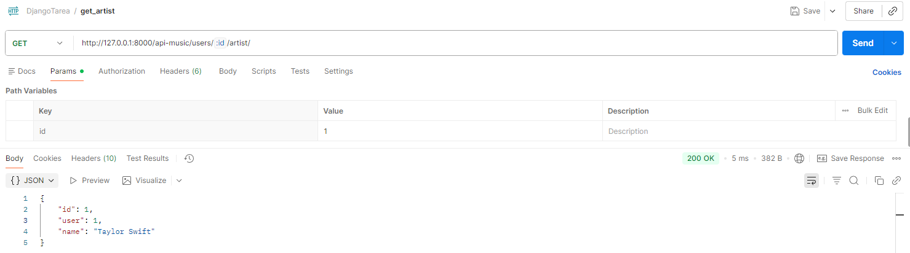

### PUT /api-music/users/{id}/artist/ - Actualizar artista favorito

Permite **actualizar el artista favorito** de un usuario concreto. 

**Validaciones y lógica:**
- Se comprueba que el usuario exista.
- Si no existe artista favorito, se crea mediante `get_or_create`.
- Se permite la actualización parcial de datos (`partial=True`).
- Se validan los datos recibidos mediante el serializer.

**Respuestas:**
- `200 OK` → artista favorito actualizado correctamente.
- `400 Bad Request` → datos no válidos.
- `404 Not Found` → el usuario no existe.

**Captura Postman:**
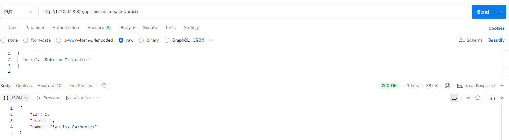

<

### DELETE /api-music/users/{id}/artist/ - Eliminar artista favorito

Este endpoint permite **eliminar el artista favorito** asociado a un usuario.

**Validaciones y lógica:**
- Se intenta eliminar el artista favorito asociado al usuario.
- Si no existe un artista favorito, se devuelve un error controlado.

**Respuestas:**
- `204 No Content` → artista favorito eliminado correctamente.
- `404 Not Found` → no existe artista favorito para ese usuario.

**Captura Postman:**

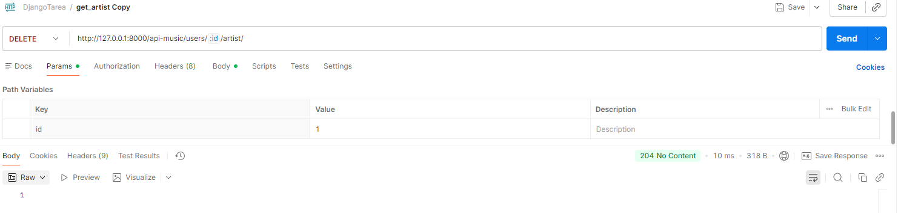

---

### POST /api-music/users/{id}/track/ - Añadir canción favorita

Permite asignar una canción favorita a un usuario.

**Validaciones:**
- El usuario debe existir
- No debe existir ya una canción favorita

**Captura Postman:**
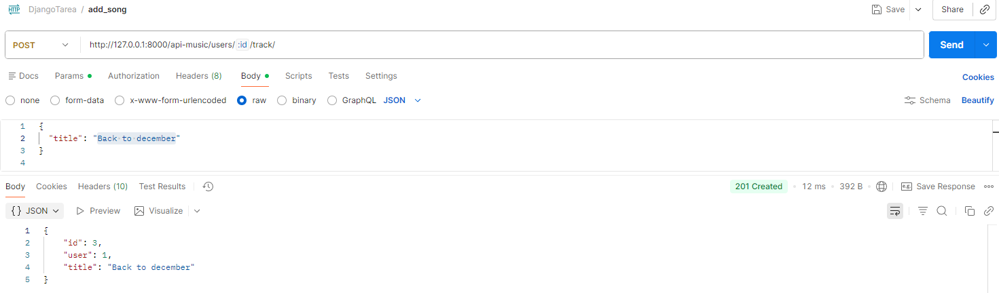

### GET /api-music/users/{id}/track/ - Obtener canción favorita

Devuelve la canción favorita asociada a un usuario.

 **Captura Postman:**

 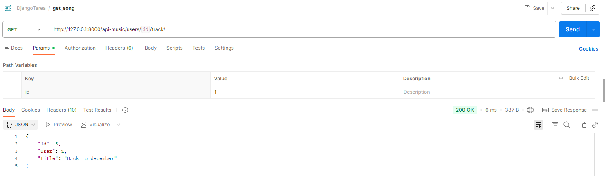

### PUT /api-music/users/{id}/track/ - Actualizar canción favorita

Permite **actualizar la canción favorita** de un usuario concreto.  

**Validaciones y lógica:**
- Se comprueba que el usuario exista.
- Si no existe una canción favorita, se crea mediante `get_or_create`.
- Se permite la actualización parcial de datos (`partial=True`).
- Se validan los datos recibidos mediante el serializer.

**Respuestas:**
- `200 OK` → canción favorita actualizada correctamente.
- `400 Bad Request` → datos no válidos.
- `404 Not Found` → el usuario no existe.

**Captura Postman:**

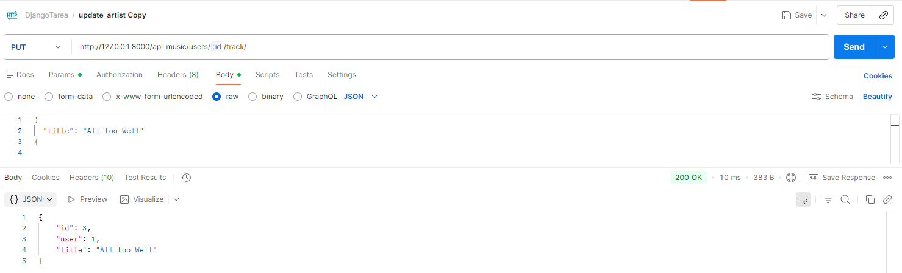

### DELETE /api-music/users/{id}/track/ - Eliminar canción favorita

Este endpoint permite **eliminar la canción favorita** asociada a un usuario.

**Validaciones y lógica:**
- Se intenta eliminar la canción favorita asociada al usuario.
- Si no existe una canción favorita, se devuelve un error controlado.

**Respuestas:**
- `204 No Content` → canción favorita eliminada correctamente.
- `404 Not Found` → no existe canción favorita para ese usuario.

**Captura Postman:**

## Integración con spotify

### GET /api-music/users/{id}/artist/spotify/ - Obtener información del artista desde Spotify

Este endpoint consulta la API de Spotify utilizando el nombre del artista favorito
almacenado en la base de datos.

**Respuesta:**
- 200 OK con datos reales de Spotify
- 404 Not Found si no hay artista
- 502 Bad Gateway si falla Spotify

**Captura Postman:**
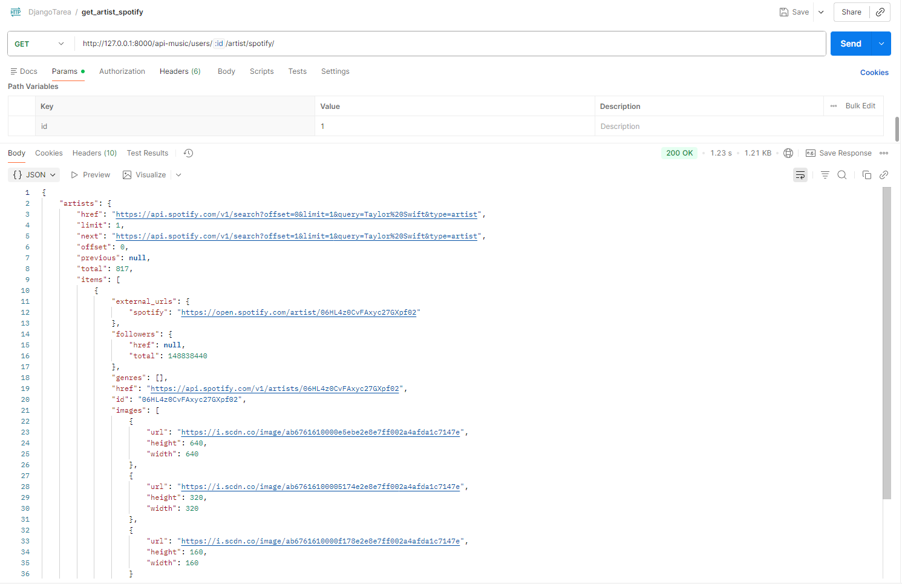

### GET /api-music/users/{id}/track/spotify/ - Obtener información de la canción desde Spotify

Este endpoint consulta la API de Spotify utilizando el nombre de la canción favorita del usuario..

**Respuesta:**
- 200 OK con datos reales de Spotify
- 404 Not Found si no hay artista
- 502 Bad Gateway si falla Spotify
**Captura Postman:**

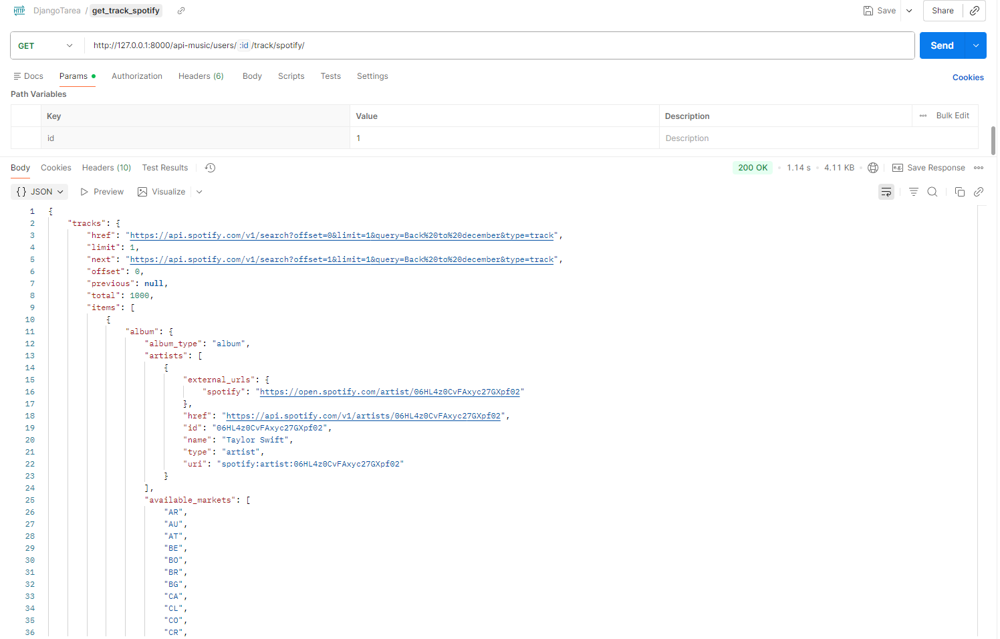

## Mejoras futuras

Como posibles mejoras del proyecto, se plantean las siguientes:

- **Implementación de tests automáticos**, utilizando las herramientas de testing de Django para verificar el correcto funcionamiento de los endpoints y los casos de error.
- **Mejora del manejo de errores de Spotify**, controlando el caso en el que no se obtengan resultados en la búsqueda y devolviendo respuestas más específicas.
- **Ampliación del modelo de preferencias**, permitiendo gestionar más de una canción o artista por usuario, o añadir nuevos tipos de preferencias musicales.
- **Documentación adicional de la API**, incorporando ejemplos de peticiones y respuestas o herramientas como Swagger/OpenAPI para facilitar su comprensión.

Estas mejoras permitirían evolucionar el proyecto hacia una API más robusta, eficiente y preparada para un entorno de producción.

## Conclusiones

El desarrollo de este proyecto ha permitido aplicar de forma práctica los conceptos fundamentales del backend con Python, mediante la creación de una API REST utilizando Django y Django REST Framework.

Se ha implementado una arquitectura modular, separando la gestión de usuarios y la gestión de preferencias musicales en aplicaciones independientes, lo que facilita la mantenibilidad y escalabilidad del código. El uso de relaciones `OneToOne` ha simplificado la lógica de negocio, garantizando que cada usuario tenga un único artista y una única canción favorita.

Asimismo, se ha trabajado la validación de datos y el manejo de errores, devolviendo respuestas HTTP coherentes ante situaciones no válidas o recursos inexistentes, lo que aporta robustez a la API.

La integración con la API externa de Spotify ha permitido enriquecer la funcionalidad del proyecto, demostrando el consumo de servicios externos mediante autenticación por credenciales y búsquedas dinámicas por nombre, sin necesidad de almacenar identificadores externos en la base de datos.

En conjunto, el proyecto cumple los objetivos planteados en el enunciado, consolidando los conocimientos adquiridos durante el módulo y dando como resultado una API funcional, bien estructurada y alineada con buenas prácticas de desarrollo backend.
